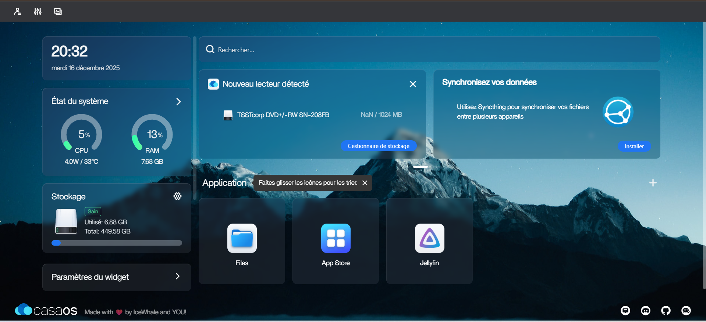
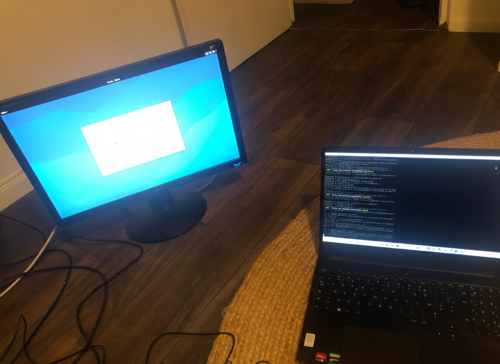

# Mon-serveur-NAS-
Documentation technique pour mon serveur NAS sous Debian 12 avec CasaOS

> **Matériel :** Dell OptiPlex 3020 SFF

> **Système :** Debian 12 (Bookworm) + CasaOS

> **Utilisateur principal :** `aymenrt`

---

##  1. Spécifications Matérielles

* **Modèle :** Dell OptiPlex 3020 SFF (Small Form Factor).
* **Processeur :** Intel Core i5 (4ème génération).
* **RAM :** 8 Go DDR3.
* **Stockage :** 1x HDD 500 Go (Partition unique : Système + Données).
* **Modifications :** Lecteur CD retiré pour permettre l'ajout d'un second disque SATA.
* **Type de setup :** "Headless" (piloté à distance en SSH avec Putty).

---

## 💾 2. Architecture Système & Réseau

* **OS :** Debian 12 avec interface graphique.
* **Gestionnaire :** [CasaOS](https://casaos.zimaspace.com/) 
* **Accès Console :** SSH configuré sur le port standard (22).
* *Connexion :* `ssh aymenrt@<IP de l'ordinateur>`
---

## 🚀 3. Installation & État Initial

### Installation de CasaOS

Effectuée via la commande officielle après l'installation de Debian :

```bash
wget -qO- https://get.casaos.io | sudo bash

```

### État du système

L'interface CasaOS confirme la bonne reconnaissance du matériel :

* **CPU :** ~2% au repos.
* **RAM :** ~15% d'utilisation sur 8 Go.
* **Stockage :** HDD 500 Go (`sda`) bien détecté et utilisé pour le stockage principal.



---

### Configuration finale
Le serveur est installé sur la machine de gauche, et je le contrôle à distance depuis mon PC portable via SSH




## 🔧 4. Maintenance & Récupération (Mode Headless)

### Récupération du mot de passe (Procédure `init=/bin/bash`)

En cas d'oubli du mot de passe root ou utilisateur, une intervention physique temporaire (écran + clavier) est nécessaire :

1. Au menu GRUB, appuyer sur `e`, chercher la ligne `linux` et modifier les droit "ro" par "rw" et ajouter `init=/bin/bash` à la fin.
2. Changer le mot de passe : `passwd root`.
3. Relancer le système : `exec /sbin/init`.

### Surveillance du démarrage sans écran

Après un redémarrage forcé ou une maintenance via `init=/bin/bash`, le serveur présente des comportements spécifiques :

* **Séquence de boot :** Se fier à la **LED d'activité disque** en façade.
* **Indicateur de fin :** Le boot est terminé quand la LED cesse de clignoter frénétiquement (environ 1 à 2 minutes).
* **Vérification automatique (fsck) :** Si l'accès SSH ne revient pas après 5 minutes, le système effectue probablement une vérification du disque après un arrêt brutal.Il faut génrealement attendre la fin du processus.

### Troubleshooting

* **Blocage BIOS :** Si le NAS ne démarre pas, le boot peut être interrompu par une alerte matérielle (châssis ouvert, erreur ventilateur).
* **Service SSH :** Toujours vérifier que le service est actif (`sudo systemctl status ssh`) avant de débrancher l'écran pour la mise en production.
---
